# TransferLearning

## 동작 방식
1. 데이터 준비:

   1. CSV 파일에서 에어컨 데이터 로드
   
   1. 세 쌍의 에어컨 데이터 처리 (1-2, 3-4, 5-6)
   
   1. 시차 변수와 다음 시점 타겟 변수 생성

1. 모델 학습 (쌍 1-2만):

   1. RobustScaler로 데이터 정규화
   
   1. 3층 ANN 모델 (128→64→출력차원) 생성
   
   1. MSE 손실 함수와 Adam 옵티마이저로 학습

   1. 조기 종료로 최적 모델 선택

1. 전이 및 평가:

   1. 쌍 1-2로 학습된 모델을 다른 쌍(3-4, 5-6)에 그대로 적용
   
   1. 각 쌍별 RMSE, R² 성능 지표 계산
   
   1. 시계열 예측 성능과 쌍 간 성능 비교 시각화

```mermaid
flowchart LR
    A[CSV 파일] --> |load_data| B[원본 데이터]
    
    subgraph DataProcessing["데이터 처리"]
        B --> |process_aircon_pair| C1[에어컨 쌍 1-2]
        B --> |process_aircon_pair| C2[에어컨 쌍 3-4]
        B --> |process_aircon_pair| C3[에어컨 쌍 5-6]
        
        C1 --> |prepare_model_data| D1[입력 특성 + 타겟변수]
        C2 --> |prepare_model_data| D2[입력 특성 + 타겟변수]
        C3 --> |prepare_model_data| D3[입력 특성 + 타겟변수]
    end
    
    subgraph ModelTraining["모델 학습 (쌍 1-2만)"]
        D1 --> |학습/검증 분할| E1[학습 데이터]
        D1 --> |학습/검증 분할| E2[검증 데이터]
        
        E1 --> |RobustScaler| F1[스케일링된 학습 데이터]
        E2 --> |RobustScaler| F2[스케일링된 검증 데이터]
        
        F1 --> |DataLoader| G[배치 데이터]
        G --> |ImprovedANN| H[모델 학습]
        H --> |MSE 손실, Adam 옵티마이저| I[학습된 모델]
        
        F2 --> |평가| J[검증 손실]
        J --> |조기 종료| I
    end
    
    subgraph ModelTransfer["다른 쌍에 모델 적용"]
        I --> K1[쌍 1-2 평가]
        I --> K2[쌍 3-4 평가]
        I --> K3[쌍 5-6 평가]
        
        D2 --> |동일한 스케일러 적용| L2[스케일링된 입력]
        D3 --> |동일한 스케일러 적용| L3[스케일링된 입력]
        
        L2 --> K2
        L3 --> K3
        
        K1 --> M1[성능 지표 1-2]
        K2 --> M2[성능 지표 3-4]
        K3 --> M3[성능 지표 5-6]
        
        M1 --> N[쌍 간 성능 비교]
        M2 --> N
        M3 --> N
    end
    
    subgraph Visualization["시각화"]
        N --> O1[시계열 시각화]
        N --> O2[성능 비교 차트]
        H --> |손실 데이터| O3[학습 곡선]
    end
    
    style DataProcessing fill:#f0f8ff,stroke:#333
    style ModelTraining fill:#fff0f5,stroke:#333
    style ModelTransfer fill:#f0fff0,stroke:#333
    style Visualization fill:#fff8f0,stroke:#333
```

